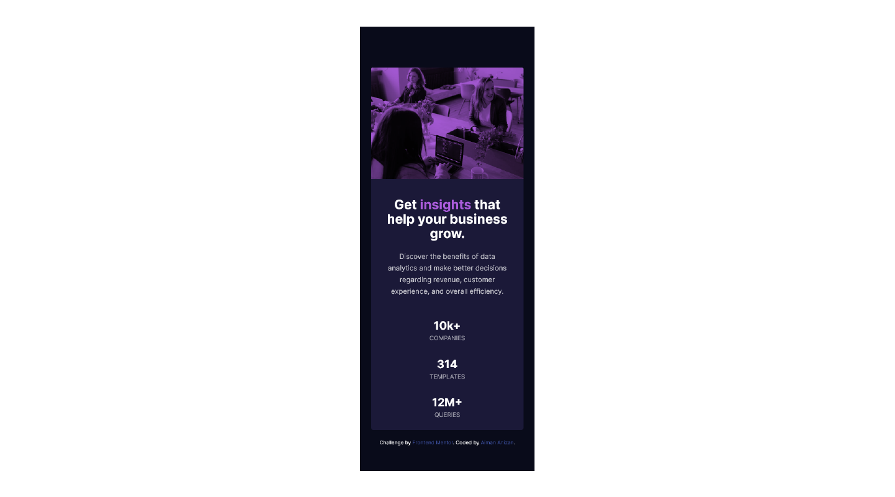
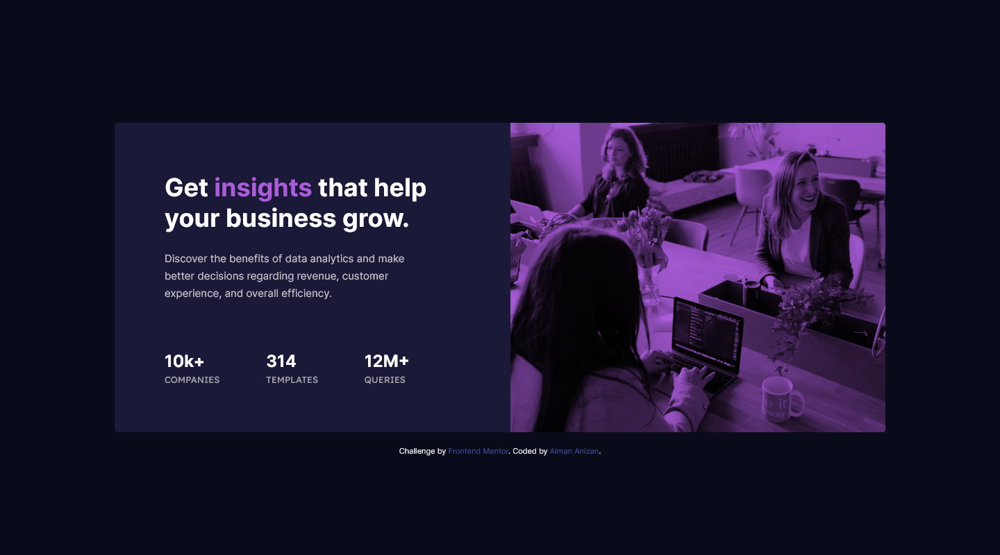

# Frontend Mentor - Stats preview card component solution

This is a solution to the [Stats preview card component challenge on Frontend Mentor](https://www.frontendmentor.io/challenges/stats-preview-card-component-8JqbgoU62). Frontend Mentor challenges help you improve your coding skills by building realistic projects.

## Table of contents

-   [Overview](#overview)
    -   [The challenge](#the-challenge)
    -   [Screenshot](#screenshot)
    -   [Links](#links)
-   [My process](#my-process)
    -   [Built with](#built-with)
    -   [What I learned](#what-i-learned)
    -   [Continued development](#continued-development)
    -   [Useful resources](#useful-resources)
-   [Author](#author)

## Overview

### The challenge

Users should be able to:

-   View the optimal layout depending on their device's screen size

### Screenshot

-   Mobile View
    

-   Desktop View
    

### Links

-   Solution URL: [Add solution URL here](https://your-solution-url.com)
-   Live Site URL: [Frontend Mentor | Stats preview card component](https://aimananizan56.github.io/Stats-Preview-Card/)

## My process

### Built with

-   Semantic HTML5 markup
-   CSS custom properties
-   Flexbox
-   Mobile-first workflow
-   SaSS
-   Gulp

### What I learned

Before this, I use `::before` selector to add color on the image :

```scss
.card {
    &__image {
        background-image: url('../images/image-header-mobile.jpg');
        &::before {
            content: '';
            background-color: var(--softviolet);
            display: block;
            width: 100%;
            height: 100%;
        }
    }
}
```

But, I found a way to make the css code shorter using the `background-blend-mode` as below :

```scss
.card {
    &__image {
        background-color: var(--softviolet);
        background-blend-mode: multiply;
        background-image: url('../images/image-header-mobile.jpg');
    }
}
```

### Continued development

I found that flexbox can help me to create website layout. So, I think I should improve my knowledge on flexbox.

### Useful resources

-   [A Complete Guide to Flexbox](https://css-tricks.com/snippets/css/a-guide-to-flexbox/) - This website help me a lot to understand more about flexbox. The guide involve flexbox basic, terms and other that useful for the beginner.
-   [background-blend-mode](https://css-tricks.com/almanac/properties/b/background-blend-mode/) - Since in this challenge need me to add color to the image, I found this website help me to get better understanding about background blend.
-   [background-image - CSS: Cascading Style Sheets | MDN](https://developer.mozilla.org/en-US/docs/Web/CSS/background-image) - MDN WEb Docs providing lot of information about website and I think this help a lot.

## Author

-   Frontend Mentor - [@AimanAnizan56](https://www.frontendmentor.io/profile/AimanAnizan56)
